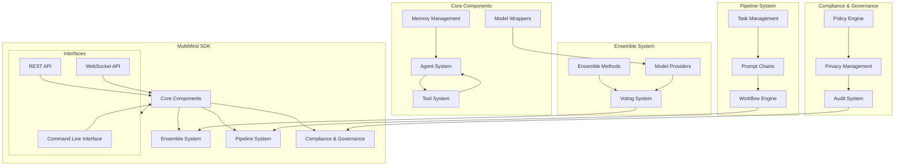
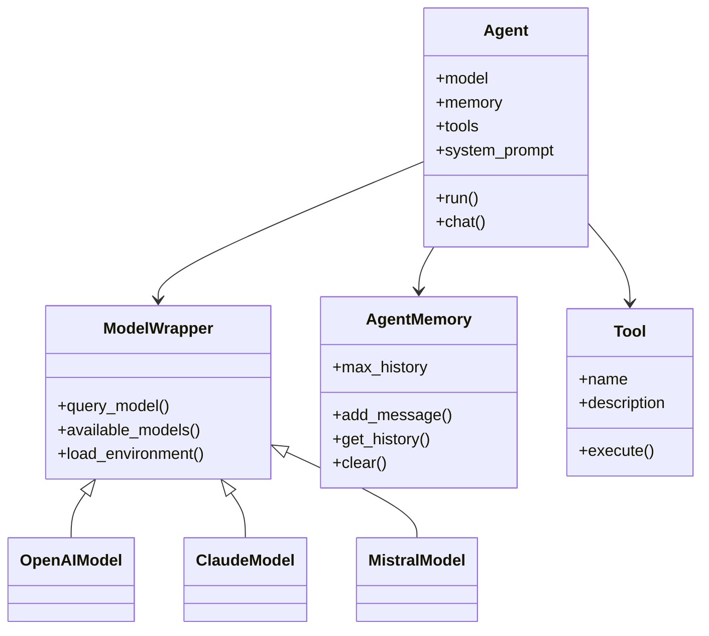
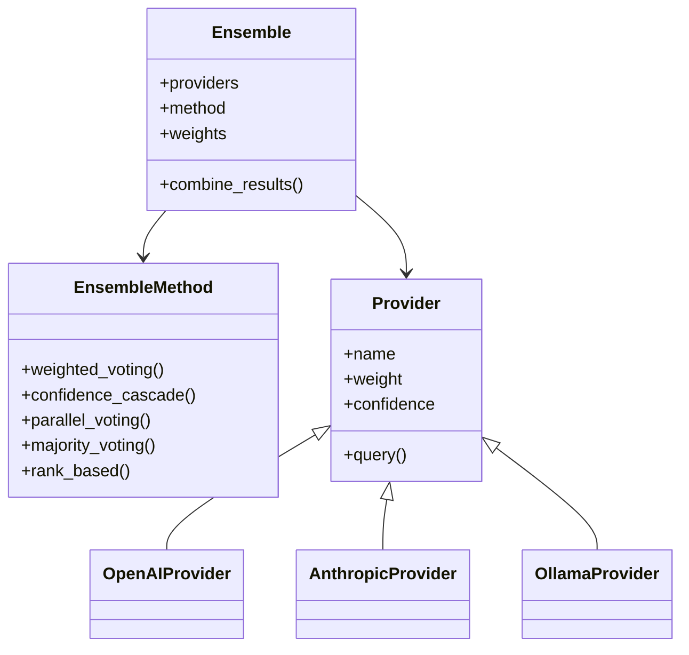
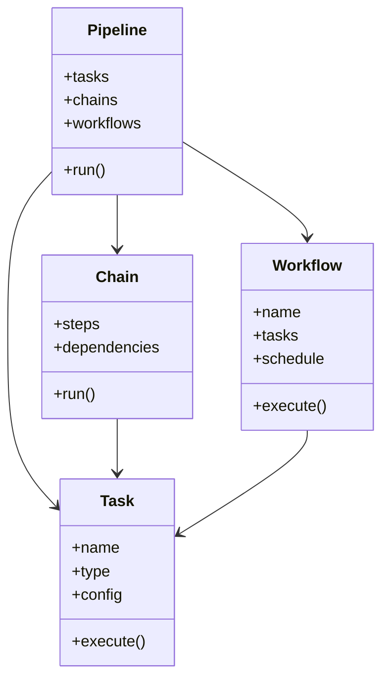
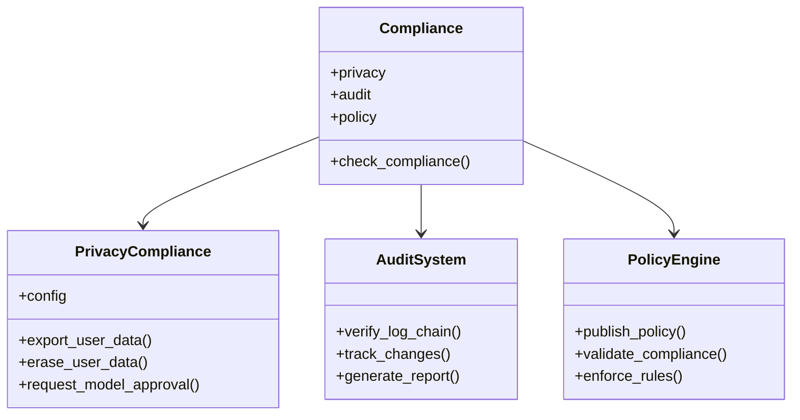
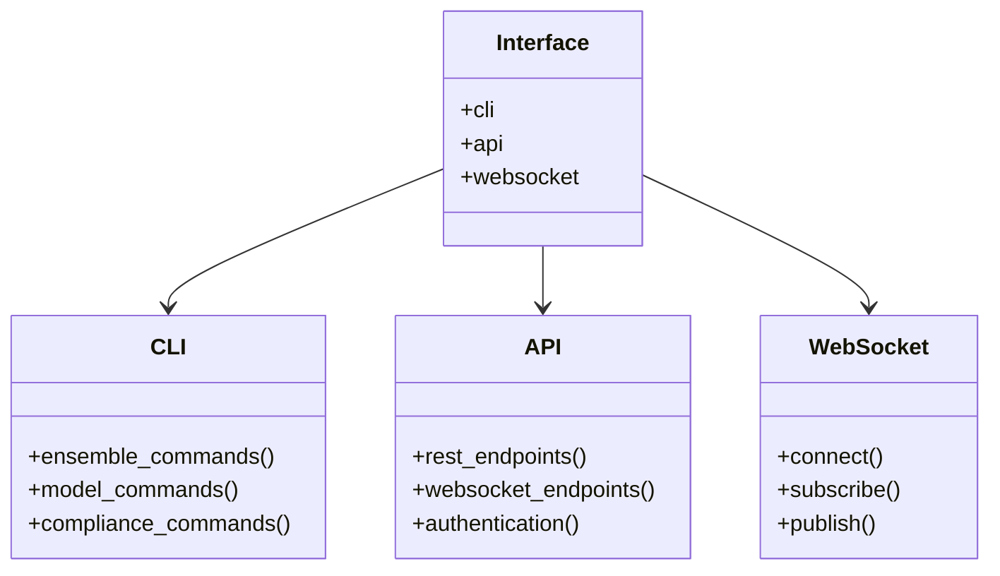
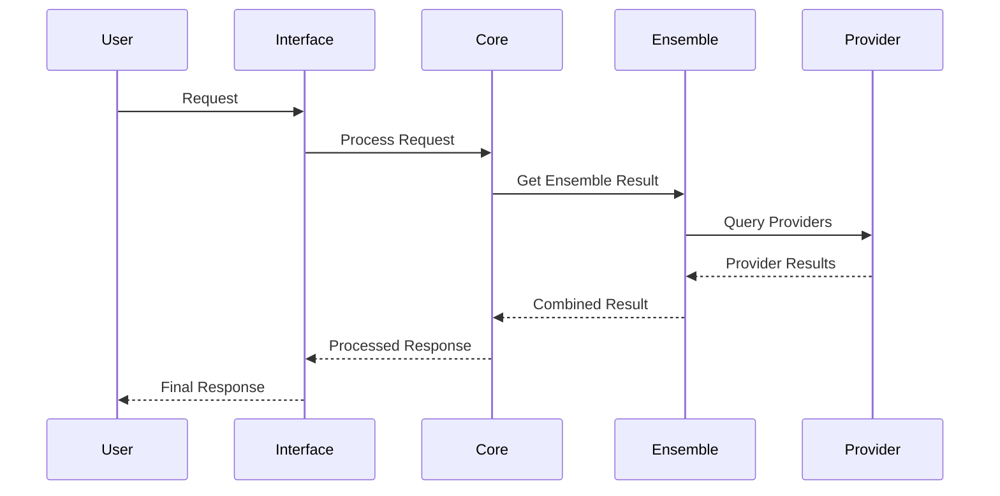
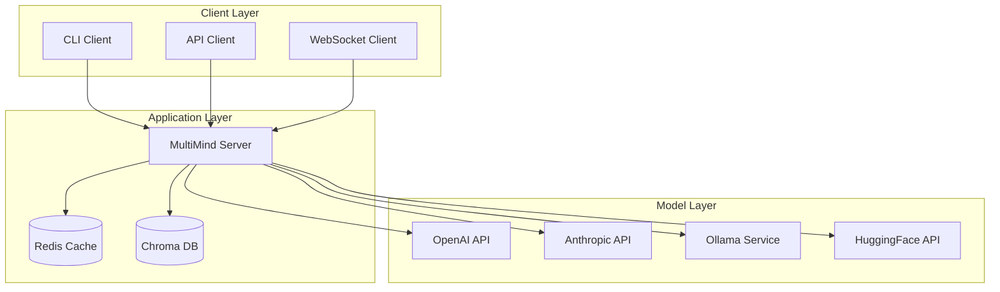
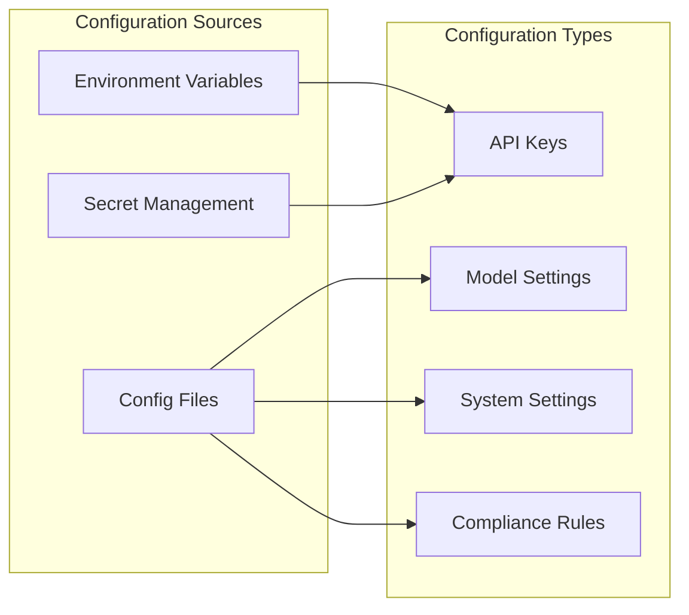
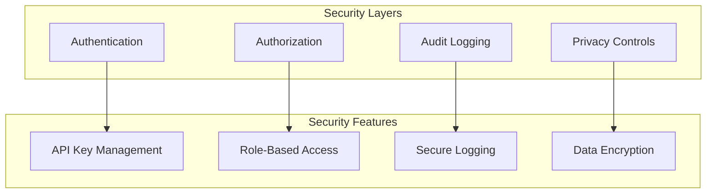

# MultiMind Architecture

This document provides a comprehensive overview of the MultiMind SDK architecture, including its core components, interfaces, and data flow.

## System Overview

## Component Details

### Core Components

### Ensemble System

### Pipeline System

### Compliance & Governance

### Interfaces

## Data Flow

## Deployment Architecture

## Configuration

The architecture supports various configuration options through environment variables and configuration files:

## Security Architecture

This architecture documentation provides a comprehensive overview of the MultiMind SDK's structure and components. Each diagram illustrates different aspects of the system, from high-level overview to detailed component interactions. 