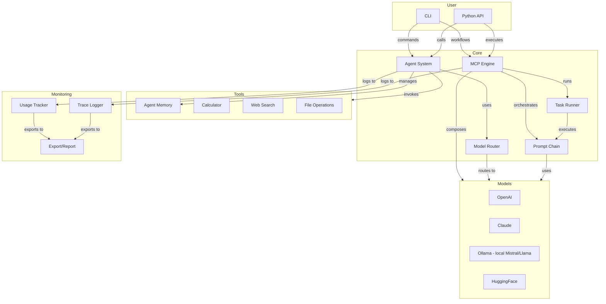

# MultiMind SDK: Features & Functions

> For the authoritative, per-feature status (Stable / Beta / Planned), see [FEATURES.md](../FEATURES.md) in the repository root. This page gives a structural overview; items marked "Planned" below are not implemented yet.

## Project Structure

Below is the representative modular structure for MultiMind SDK:

```
multimind-sdk/
├── multimind/
│   ├── __init__.py
│   ├── config.py                   # Central config loader
│
│   ├── models/                    # Unified model wrappers
│   │   ├── base.py                # Base model interface
│   │   ├── openai.py              # OpenAI model wrapper
│   │   ├── claude.py              # Claude model wrapper
│   │   ├── huggingface.py         # HuggingFace model wrapper
│   │   └── ollama.py              # Ollama wrapper (local models incl. Mistral, Llama)
│
│   ├── router/                    # Model routing and selection
│   │   ├── strategy.py            # Routing strategies
│   │   ├── fallback.py            # Fallback handling
│   │   └── router.py              # Main router implementation
│
│   ├── rag/                       # Retrieval-Augmented Generation
│   │   ├── base.py                # Base RAG interface
│   │   ├── embedder.py            # Embedding utilities
│   │   └── vector_store.py        # Vector store integration
│
│   ├── fine_tuning/              # Training and adaptation
│   │   ├── lora_trainer.py        # LoRA training
│   │   ├── qlora_trainer.py       # QLoRA training
│   │   └── dataset_loader.py      # Dataset handling
│
│   ├── agents/                   # Agent system
│   │   ├── agent.py               # Agent implementation
│   │   ├── memory.py              # Agent memory
│   │   ├── agent_loader.py        # Agent configuration loading
│   │   └── tools/
│   │       ├── web_search.py      # Web search tool
│   │       ├── calculator.py      # Calculator tool
│   │       └── file_reader.py     # File operations tool
│
│   ├── orchestration/           # Workflow orchestration
│   │   ├── prompt_chain.py        # Prompt chaining
│   │   └── task_runner.py         # Task orchestration
│
│   ├── mcp/                     # Model Composition Protocol
│   │   ├── parser.py             # MCP workflow parser
│   │   ├── executor.py           # MCP workflow executor
│   │   └── schema.json           # MCP schema definition
│
│   ├── integrations/           # Service integrations
│   │   ├── github.py              # GitHub integration
│   │   ├── slack.py               # Slack integration
│   │   ├── discord.py             # Discord integration
│   │   ├── jira.py                # Jira integration
│   │   └── model_adapters.py      # Model adapter layer
│
│   ├── logging/                # Monitoring and logging
│   │   ├── trace_logger.py        # Trace logging
│   │   └── usage_tracker.py       # Usage tracking
│
│   ├── cli/                    # Command-line interface
│   │   ├── main.py                # CLI entry point
│   │   └── commands/
│   │       ├── agent.py           # Agent commands
│   │       ├── run_mcp.py         # MCP workflow commands
│   │       └── finetune.py        # Fine-tuning commands
│
├── examples/                   # Example scripts
├── configs/                    # Configuration templates
├── tests/                      # Test suite
├── docs/                       # Documentation
├── README.md
├── LICENSE
├── pyproject.toml
└── setup.py
```

---

## Core Features

### Model Support

- **Model Wrappers (available today):**
  - OpenAI (GPT-3.5, GPT-4)
  - Anthropic Claude
  - Ollama (local models, including Mistral and Llama)
  - HuggingFace wrapper (experimental)
- **Unified Interface:** All wrappers support `generate`, `chat`, and `embeddings` (where applicable), with streaming
- **Non-Transformer Inference:** Mamba and RWKV run via HuggingFace-backed wrappers; other listed architectures are extension scaffolds only

### Agent System

- **Agent Framework (available today):**
  - Configurable agents with memory and tools (keyword-based tool routing)
  - Agent configuration loading from MCP files
  - Built-in tools (calculator, web search, file operations)
  - Extensible tool system
- **Planned:** agent collaboration, hierarchical multi-agent systems, inter-agent communication, AutoML-based agent configuration
- **Memory Management:**
  - Conversation history tracking
  - Configurable memory size
  - Memory persistence

### Orchestration

- **Prompt Chains:**
  - Multi-step reasoning workflows
  - Variable substitution
  - Conditional execution
- **Task Runner:**
  - Task dependencies
  - Retry logic
  - Context management
  - Parallel execution

### Model Composition Protocol (MCP)

> Note: this is MultiMind's own **Model Composition Protocol**, a JSON/YAML workflow executor for chaining models. It is not Anthropic's Model Context Protocol, which MultiMind does not support yet.

- **Workflow Definition:**
  - JSON/YAML-based workflow specification
  - Model composition and chaining
  - Conditional execution
  - Data transformation
- **Execution Engine:**
  - Workflow validation
  - Model registration
  - Step execution
  - Error handling

### Routing & Strategy

- **Model Router:**
  - Strategy-based routing (cost-aware, latency-aware, hybrid)
  - Fallback chain for robust inference
  - Dynamic model selection

### Fine-Tuning & PEFT

- **Available today (basic):** LoRA and adapter training
- **Planned/experimental:** QLoRA, IA³, BitFit, Compacter, HyperLoRA, UniPELT, MAM, AutoML-based parameter tuning, meta-learning (MAML, Reptile)
- **RAG (Retrieval-Augmented Generation):**
  - Vector store support (FAISS, Chroma today; Qdrant, Weaviate, Pinecone, Milvus in beta)
  - Embedding and retrieval utilities
  - Planned: self-tuning indexer, hybrid search with knowledge graph

### Enterprise Integration

- **Compliance Suite (available today):**
  - GDPR and HIPAA policy modeling
  - Data governance framework
  - Audit logging
  - Compliance dashboards (with the `[compliance]` extra)
- **Service Integrations (available today):** GitHub, Slack, Discord, Jira
- **Planned:** edge deployment toolkit, plugin system (Notion, Salesforce), database connectors, real-time data integration (Kafka, MQTT)

### Development Tools

- **Planned:** visual workflow builder, drag-and-drop components, no-code interface, monitoring dashboard with live state and workflow visualization

### Logging & Monitoring

- **Usage Tracking:**
  - Token usage monitoring
  - Cost tracking
  - Operation logging
- **Trace Logging:**
  - Request/response tracing
  - Performance metrics
  - Error tracking
- **Export & Reporting:**
  - JSON/CSV export
  - Usage summaries
  - Cost analysis

### Configuration

- **Config Management:**
  - YAML/JSON config files
  - `.env` and environment variable support
  - CLI and SDK config sharing

### CLI & Integration

- **CLI:**
  - Agent management
  - MCP workflow execution
  - Fine-tuning commands
  - Usage monitoring
- **Service Integrations:**
  - GitHub, Slack, Discord, Jira
  - Model adapter classes for custom model types

---

## Feature Table

| Category          | Feature/Functionality                                      | Status      |
|-------------------|----------------------------------------------------------|-------------|
| Model Wrappers    | OpenAI, Claude, Ollama (incl. local Mistral/Llama)       | Implemented |
| Non-Transformers  | Mamba, RWKV inference; other architectures are scaffolds | Beta        |
| Agent System      | Framework, memory, tools (keyword-based routing)         | Beta        |
| Agent AutoML      | Self-configuration, optimization                         | Planned     |
| Orchestration     | Prompt chains, task runner                               | Implemented |
| MCP (Composition) | Workflow definition, execution, model composition        | Beta        |
| Routing           | Strategy, fallback, dynamic selection                    | Implemented |
| Compliance        | GDPR/HIPAA policy modeling, audit trails, dashboards     | Beta        |
| Enterprise        | Edge deployment, integration hub                         | Planned     |
| Development Tools | Visual builder, no-code interface, templates             | Planned     |
| Fine-Tuning       | Basic LoRA/adapters; advanced PEFT and meta-learning     | Beta        |
| RAG               | FAISS/Chroma stable; hybrid search and self-tuning       | Beta        |
| Monitoring        | Basic logging and usage tracking; dashboards planned     | Beta        |
| Integrations      | GitHub, Slack, Discord, Jira                             | Beta        |

---

## Examples

The SDK includes examples demonstrating the major features:

- [Basic Agent Usage](../examples/cli/basic_agent.py) - Agent creation and usage
- [Prompt Chaining](../examples/cli/prompt_chain.py) - Multi-step reasoning workflows
- [Task Running](../examples/cli/task_runner.py) - Workflow orchestration
- [MCP Workflows](../examples/cli/mcp_workflow.py) - Model composition examples
- [Usage Tracking](../examples/cli/usage_tracking.py) - Monitoring and logging

See the [examples README](../examples/README.md) for detailed usage instructions.

---

## Architecture Overview



For more details, see the [Architecture Overview](architecture.md) and [Development Guide](development.md)
